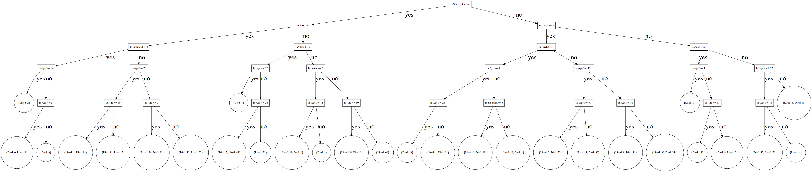

## Simple decision tree

To output the predictions to stdout run :

```
cargo run -- -t train.csv -s test.csv
```

Uploading to Kaggle gives this a score of 0.71291


To test the tree against the all females live dataset run :

```
cargo run -- -t train.csv -s test.csv -c check.csv
```
Currently we get a different answer every time from 77%-80%. No idea why..

To create a dot file of the tree :

```
cargo run -- -t train.csv -d titanic.dot 
cat titanic.dot | dot -Tpng >> titanic.png 
```

This is our tree :


# Pruned tree

Let's use cross validation to see what the best depth of our tree is. If we keep on making our tree to the biggest depth possible we end up over fitting, which does us no favours at all!

Add the --depth flag :

```
cargo run --release -- --train train.csv  --test test.csv --depth --dot pruned.dot
```

This gives up the following tree :




And uploading to Kaggle now gives us a score of .77990 (5,586th place!).

